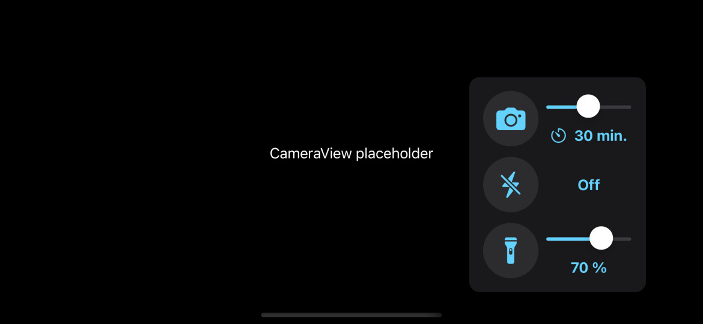

# BlobStar ✨

[English version 🇺🇸](./README.md)

Application iOS pour automagiquement contrôler la torche / le flash de l'appareil et capturer des photos à interval régulier.

Le logiciel a été rapidement prototypé pour suivre l'évolution de quelques [Physarum Polycephalum](https://fr.wikipedia.org/wiki/Physarum_polycephalum) dans le cadre de l'expérience [#EleveTonBlob](https://disciplines.ac-toulouse.fr/daac/elevetonblob-lexperience-educative-du-cnes-pour-la-mission-alpha) de la [Mission Alpha](https://missionalpha.cnes.fr/).
Ce projet sur-mesure a été imaginé par un parent d'élève bénévole pour aider une école primaire dans le Jura français, non loin de l'endroit où le premier [Comté](https://france3-regions.francetvinfo.fr/bourgogne-franche-comte/jura/espace-thomas-pesquet-savoure-du-comte-1207393.html) 🧀 sur l'ISS a été produit.

Les photos sont enregistrées dans la photothèque de l'appareil et sont vouées à être regroupées dans un fichier vidéo plus tard.
Consultez la section [post-traitement](#post-traitement) pour des exemples.

Le nom est un jeu de mots entre "blob", l'autre nom que les français 🇫🇷 donnent au Physarum Polycephalum, et le morceau [Rock Lobster](https://www.youtube.com/watch?v=n4QSYx4wVQg) de The B-52's 🦞

## Fonctionnalités

* Prends des photos toutes les 1 à 60 minutes
* Contrôle l'intensité de la torche et le mode du flash
* Allume puis éteins la torche lors des prises
* Enregistre les coordonnées géographiques dans les données EXIF
* Enregistre les photos dans la photothèque
* Réglages utilisateur persistants
* Empêche la veille de l'appareil lorsque l'application est active

## Aperçu

Une image vaut mille mots, alors voici une capture écran dans le simulateur:



## Confidentialité 🔒

L'application a besoin d'accéder à certaines fonctions sensibles, telles que:

| Option | Indispensable | Description |
|-|:-:|-|
| Appareil     | ✅ | Prévisualiser et capturer la caméra
| Localisation | ❌ | Enregistrer les coordonnées géographiques dans les données EXIF
| Photos       | ✅ | Enregistrer les photos dans la photothèque

Les permissions d'accéder à la géolocalisation et à la caméra sont demandées lors du premier démarrage.

La permission d'accéder à la photothèque est demandée lors de l'enregistrement d'une première photo.
Appuyez sur le bouton Caméra 📷 pour déclencher la demande en premier.

Le logiciel plante exprès `fatalError()` lorsqu'il ne peut pas accéder à la caméra 🐞 et aucune photo n’est enregistrée lorsqu'il ne peut pas accéder à la photothèque.
C'est un ~~piètre~~ choix de conception pour livrer le projet dans les temps, et les options de confidentialité peuvent être réparées ultérieurement dans le panneau de réglages BlobStar de l'application _Réglages_.

## Compilation

Le projet a été conçu avec [Xcode](https://developer.apple.com/xcode/) version 13 et testé sur des appareils récents avec iOS version 15.

Compiler et installer des logiciels iOS est facile, tant que vous respectez les prérequis de [signature du code](https://developer.apple.com/support/code-signing/).
C'est bien ça, n'importe qui avec un Mac et enregistré gratuitement comme [développeur](https://developer.apple.com/) peut installer Xcode pour compiler et installer des applications iOS, avec quelques limitations comme la période de validité du profil de provisionnement.

Le code source est fourni en l'état et ça ne va pas être possible de me contacter pour de l'assistance (ce fichier contient tout ce dont vous avez besoin) ou des demandes de fonctionnalités supplémentaires en dehors du cadre de l'expérience.
Les demandes de fusion (Pull Request) et les bifurcations (Fork) responsables sont les bienvenues.

## Post-traitement

Sur macOS, vous pouvez exporter les photos de l'appareil depuis les applications _Photos_ ou _Transfert d’images_, puis utiliser la commande [Ouvrir la séquence d’images](https://support.apple.com/guide/quicktime-player/create-a-movie-with-an-image-sequence-qtp315cce984) de _QuickTime Player_ pour générer le fichier vidéo.

Les utilisateurs avancés pourraient préférer:

* l'outil en ligne de commande `sips` pour convertir les images [HEIC](https://fr.wikipedia.org/wiki/High_Efficiency_Image_File_Format) en [PNG](https://fr.wikipedia.org/wiki/Portable_Network_Graphics) ou [TIFF](https://fr.wikipedia.org/wiki/Tagged_Image_File_Format)
* [FFmpeg](https://trac.ffmpeg.org/wiki/Slideshow) pour générer un film séquence [H.264](https://fr.wikipedia.org/wiki/H.264) ou [ProRes](https://fr.wikipedia.org/wiki/Apple_ProRes)

Exemple:

```bash
# Aller au dossier photo
cd /chemin/du/dossier/photo

# Convertir les fichiers HEIC en PNG
find . -name "*.HEIC" | sort | while read filename
do
    sips -s format png "${filename}" -o "${filename%.*}.png"
done

# Créer un fichier vidéo H.264 de 12 images par seconde
ffmpeg -framerate 12 -pattern_type glob -i "*.png" -c:v libx264 -pix_fmt yuv420p output.mp4

# Créer un fichier vidéo ProRes de 12 images par seconde
ffmpeg -framerate 12 -pattern_type glob -i "*.png" -c:v prores -profile:v 3 -pix_fmt yuv422p10 output.mov
```

Les options `ffmpeg` pour éventuellement [transposer](https://ffmpeg.org/ffmpeg-filters.html#transpose-1) les images de 90 degrés dans le sens horaire sont : `-vf "transpose=1"`

Utilisez le gestionnaire de paquets [Homebrew](https://brew.sh/) pour installer FFmpeg et ses dépendances 🍺

## Remerciements

Un grand merci aux pilotes, chercheurs, ingénieurs, _etc._ qui transforment le rêve de la découverte spatiale en réalité.
Je suis si heureux que vous partagiez vos recherches avec les enfants ici-bas 🌍

Aussi, j'utilise le logo de la mission comme icône de l'application sans autorisation, désolé 😅
