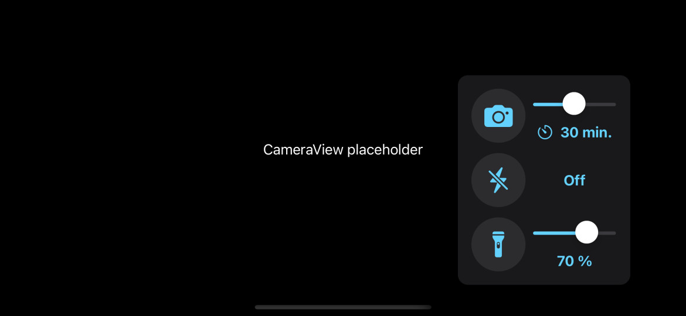

# BlobStar ✨

[Version française 🇫🇷](./LISEZMOI.md)

iOS application to automagically control the device torch/flash and capture photos.

The software was quickly drafted to monitor some [Physarum Polycephalum](https://en.wikipedia.org/wiki/Physarum_polycephalum) evolution during the [Mission Alpha](https://missionalpha.cnes.fr/)'s experiment [#EleveTonBlob](https://disciplines.ac-toulouse.fr/daac/elevetonblob-lexperience-educative-du-cnes-pour-la-mission-alpha).
This custom project was crafted by a volunteer parent to help a primary school in French Jura, not so far away from where the first [Comté](https://france3-regions.francetvinfo.fr/bourgogne-franche-comte/jura/espace-thomas-pesquet-savoure-du-comte-1207393.html) 🧀 to the ISS was produced.

Photos are saved in the device Photo Library and are meant to be aggregated in a movie file later.
Consult the [post-processing](#post-processing) section for examples.

The name is a word play on "blob", the other name The French 🇫🇷 give to the Physarum Polycephalum, and The B-52's track [Rock Lobster](https://www.youtube.com/watch?v=n4QSYx4wVQg) 🦞

## Features

* Take photo every 1 to 60 minutes
* Control torch level and flash mode
* Turn on then off torch during capture
* Store geo-coordinates in photo EXIF data
* Save photo in Photo Library
* Persistent user settings
* Prevent device from sleeping when app is active

## Preview

A picture is worth a thousand words, so here you have a Simulator screen shot:



## Privacy 🔒

The app needs to access some Privacy sensitive features, such as:

| Privacy | Permission | Required | Usage |
|-|-|:-:|-|
| Camera        | Access the Camera          | ✅ | Preview and capture photos
| Location      | Allow While Using App      | ❌ | Store device location in photo EXIF data
| Photo Library | Allow Access to All Photos | ✅ | Store photo in the device library

Location and Camera permissions are requested at the app first launch.

Photo Library permission is requested during the first photo capture.
Press the Camera 📷 button to trigger the authorization first.

The app raises a `fatalError()` when it can't access the camera 🐞 and no photo is saved when it can't access the Photo Library.
This is by ~~poor~~ design because of rushed deadlines, and Privacy options can later be fixed in the BlobStar preferences panel of the _Settings_ app.

## Build

The app was developed with [Xcode](https://developer.apple.com/xcode/) version 13 and tested on recent devices running iOS version 15.

It is trivial to build and run the app on any device, as long as you deal with the [Code Signing](https://developer.apple.com/support/code-signing/) requirements.
That's it, anyone with a Mac and registered as a free [Developer](https://developer.apple.com/) can install Xcode to build and install iOS apps, with just a few limitations such as the provisioning profile expiration period.

The project source code is provided as is and it's not ok to contact me for support (this file covers pretty much everything you need) or feature requests beyond the scope of the mission.
Responsible pull requests and forks are welcome.

## Post-processing

On macOS, you can export the photos from the device using either _Photos_ or _Image Capture_ app, then use the [Open Image Sequence](https://support.apple.com/guide/quicktime-player/create-a-movie-with-an-image-sequence-qtp315cce984) command in _QuickTime Player_ app to create the video file.

Advanced users may prefer running:

* the scriptable image processing system command-line interface `sips` to convert [HEIC](https://en.wikipedia.org/wiki/High_Efficiency_Image_File_Format) images to [PNG](https://en.wikipedia.org/wiki/Portable_Network_Graphics) or [TIFF](https://en.wikipedia.org/wiki/TIFF)
* [FFmpeg](https://trac.ffmpeg.org/wiki/Slideshow) to create [H.264](https://en.wikipedia.org/wiki/Advanced_Video_Coding) or [ProRes](https://en.wikipedia.org/wiki/Apple_ProRes) sequential movie files

Example:

```bash
# Go to photo directory
cd /path/to/photo/dir

# Convert HEIC files to PNG
find . -name "*.HEIC" | sort | while read filename
do
    sips -s format png "${filename}" -o "${filename%.*}.png"
done

# Create a 12 frames per second H.264 video file
ffmpeg -framerate 12 -pattern_type glob -i "*.png" -c:v libx264 -pix_fmt yuv420p output.mp4

# Create a 12 frames per second ProRes video file
ffmpeg -framerate 12 -pattern_type glob -i "*.png" -c:v prores -profile:v 3 -pix_fmt yuv422p10 output.mov
```

And here you have `ffmpeg` options to eventually [transpose](https://ffmpeg.org/ffmpeg-filters.html#transpose-1) images by 90 degrees clockwise: `-vf "transpose=1"`

Use [Homebrew](https://brew.sh/) package manager to install FFmpeg and its dependencies 🍺

## Acknowledgments

Many thanks to the wonderful pilots, doctors, engineers, _etc._ who turn the Space discovery dream into a reality.
I am so glad you are sharing your research with all the kids down here 🌍

Also, I am using the mission logo for the app icon without permission, sorry 😅
